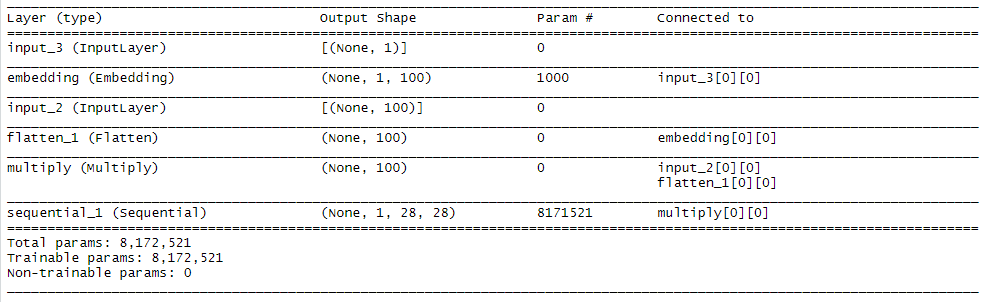
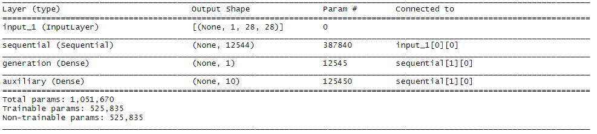
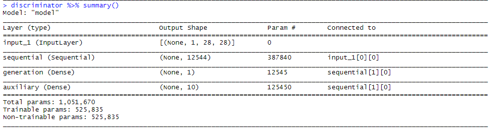

# ACGAN on MNIST & Fashion MNIST w/ RStudio & Keras
This is the implementation of auxiliary classifier generative adversarial network (ACGAN) on the MNIST and Fashion MNIST Dataset using Rstudio and Keras. This implementation is based on the [example code](https://keras.rstudio.com/articles/examples/mnist_acgan.html) provided by keras on R. The example code runs on the MNIST Dataset. I've added the implementation for the Fashion MNIST dataset.

## Setup
Install Rstudio and Anaconda.

## Run
For the MNIST experiment, open `ACGAN-RStudio-Keras/ML_No7_MNIST_ACGAN.R` using Rstudio.\
For the Fashion MNIST experiment, open `ACGAN-RStudio-Keras/ML_No7_FMNIST_ACGAN.R` using Rstudio.\
Running the whole program will train the generator and discriminator model, and saves the model into your PC.\
I've included my generator and discriminator model which I've trained before in `models/`, which are:
* `generator_acgan_mnist_r`, it's the generator model for the MNIST experiment.
* `discriminator_acgan_mnist_r`, it's the discriminator model for the MNIST experiment.
* `generator_acgan_fashion_mnist_r`, it's the generator model for the Fashion MNIST experiment.
* `discriminator_acgan_fashion_mnist_r`. it's the discriminator model for the Fashion MNIST experiment.

The models is too big to upload on GitHub, so I uploaded it on Google Drive, here's the link:
* `generator_acgan_mnist_r` & `discriminator_acgan_mnist_r` https://drive.google.com/open?id=1_6rsdqGpmzlwhrVptK4f7_-gzGfL7mgx
* `generator_acgan_fashion_mnist_r` & `discriminator_acgan_fashion_mnist_r` https://drive.google.com/open?id=1RPIkHtN2vKt_DZBiNnr4ONSQQRDiZ13R

You can load the model by running this part of the code:
```
library(keras)
library(progress)
library(abind)
k_set_image_data_format('channels_first')

load_generator <- load_model_hdf5("generator_acgan_mnist_r.h5")
load_discriminator <- load_model_hdf5("discriminator_acgan_mnist_r.h5")
```

## Experiment Results
The model was run for 50 epochs for both the MNIST and Fashion MNIST Dataset.\
The gifs below show the generated images from the model from the first epoch until the 50th epoch.

### MNIST


### The Loss (MNIST)
Here are the generator and discriminator loss on the MNIST dataset experiment. It shows the loss for the train and test set.

### Generator Loss


### Discriminator Loss


### Fashion MNIST


### The Loss (Fashion MNIST)
Here are the generator and discriminator loss on the Fashion MNIST dataset experiment. It shows the loss for the train and test set.

### Generator Loss


### Discriminator Loss


### Summary 
Here are the summary of each model:

### Generator (MNIST)


### Discriminator (MNIST)


### Generator (Fashion MNIST)


### Discriminator (Fashion MNIST)

